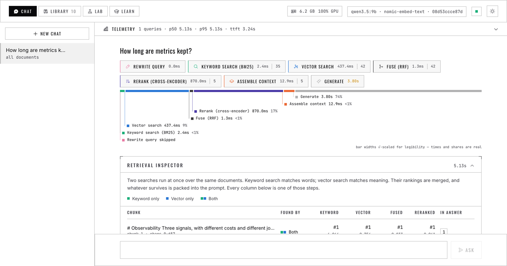

# clear-rag

A local-first RAG system whose retrieval process is visible: you watch every search, fusion and rerank happen before the answer arrives.



## Features

- Streams every retrieval stage to the UI as it completes, then the cited answer
- Shows which search found each chunk and how it moved through fusion and reranking
- Hybrid BM25 + vector search, rank fusion, reranking and query expansion, switchable in a Lab
- Retrieval core (BM25, fusion, context assembly) built from primitives, not a framework
- Every technique judged by a measured ablation table, rendered from committed results
- Runs locally on Ollama, with OpenAI and Anthropic optional

## Results

Retrieval on a 67-question golden set over a 10-document engineering corpus, rendered from `evals/results/` (CI fails if these drift).
Hybrid search beats either retriever alone, and a 23 MB cross-encoder reranker is the largest single jump (recall@1 0.734 -> **0.927**).

<!-- results:retrieval -->

| Configuration | recall@1 | recall@5 | MRR | nDCG@5 | lexical | semantic | distractor | paraphrase |
|---|---|---|---|---|---|---|---|---|
| dense only, 50% overlap (2024 baseline) | 0.589 | 0.903 | 0.708 | 0.765 | 0.955 | 0.880 | 0.875 | 0.778 |
| dense only | 0.573 | 0.871 | 0.691 | 0.745 | 0.909 | 0.840 | 0.875 | 0.778 |
| keyword only (BM25) | 0.766 | 0.903 | 0.823 | 0.843 | 1.000 | 0.880 | 0.875 | 0.778 |
| hybrid + weighted fusion | 0.782 | 0.968 | 0.866 | 0.900 | 1.000 | 1.000 | 1.000 | 0.778 |
| hybrid + RRF | 0.734 | 0.968 | 0.841 | 0.874 | 1.000 | 1.000 | 1.000 | 0.778 |
| hybrid + RRF + multi-query | 0.653 | 0.984 | 0.802 | 0.854 | 0.955 | 1.000 | 1.000 | 1.000 |
| **hybrid + RRF + cross-encoder rerank** | 0.927 | 1.000 | 0.965 | 0.974 | 1.000 | 1.000 | 1.000 | 1.000 |
| **hybrid + RRF + rerank + multi-query** | 0.927 | 1.000 | 0.965 | 0.974 | 1.000 | 1.000 | 1.000 | 1.000 |
| hybrid + RRF, 96-token chunks | 0.702 | 0.887 | 0.789 | 0.855 | 1.000 | 0.960 | 0.875 | 0.444 |
| hybrid + RRF + multi-query, 96-token chunks | 0.540 | 0.750 | 0.636 | 0.673 | 0.864 | 0.720 | 0.875 | 0.556 |
| hybrid + RRF, 192-token chunks | 0.750 | 0.919 | 0.826 | 0.908 | 1.000 | 1.000 | 0.875 | 0.556 |
| hybrid + RRF, 256-token chunks | 0.734 | 0.952 | 0.823 | 0.862 | 1.000 | 1.000 | 0.875 | 0.778 |
| hybrid + RRF, 1024-token chunks | 0.718 | 0.968 | 0.828 | 0.864 | 1.000 | 1.000 | 1.000 | 0.778 |
| dense only, all-minilm | 0.621 | 0.911 | 0.754 | 0.800 | 0.818 | 0.960 | 0.875 | 1.000 |
| hybrid + RRF, all-minilm | 0.734 | 1.000 | 0.841 | 0.878 | 1.000 | 1.000 | 1.000 | 1.000 |
| dense only, mxbai-embed-large | 0.605 | 0.984 | 0.756 | 0.823 | 1.000 | 1.000 | 1.000 | 0.889 |
| hybrid + RRF, mxbai-embed-large | 0.798 | 0.968 | 0.872 | 0.896 | 1.000 | 1.000 | 1.000 | 0.778 |

<!-- /results:retrieval -->

Retrieval metrics cannot see attribution: on a single-document suite where recall is always perfect, a 3B model cites the wrong chunk two times in three while a 9B model is near perfect.

<!-- results:attribution -->

| Model · chunk size | retrieval recall@5 | required mentions | grounding | citation precision |
|---|---|---|---|---|
| llama3.2 · 512 | 1.000 | 0.750 | 0.333 | 0.333 |
| qwen3.5:9b · 512 | 1.000 | 1.000 | 1.000 | 1.000 |
| llama3.2 · 192 | 1.000 | 0.750 | 0.500 | 0.458 |
| qwen3.5:9b · 192 | 1.000 | 1.000 | 1.000 | 0.917 |

<!-- /results:attribution -->

On real 10-K filings, flat PDF extraction beats structured parsing, and semantic chunking hurts table questions (full analysis in [`evals/sec/README.md`](evals/sec/README.md)).

<!-- results:sec -->

| Configuration | recall@1 | recall@5 | MRR | nDCG@5 | table | structure | cross-company |
|---|---|---|---|---|---|---|---|
| **naive parser** | 0.538 | 0.872 | 0.678 | 0.764 | 0.636 | 0.875 | 0.889 |
| primitives parser | 0.436 | 0.846 | 0.596 | 0.686 | 0.545 | 0.875 | 0.778 |
| primitives + semantic chunking | 0.410 | 0.692 | 0.521 | 0.565 | 0.182 | 0.875 | 0.667 |
| primitives + breadcrumb context | 0.436 | 0.846 | 0.596 | 0.686 | 0.545 | 0.875 | 0.778 |
| primitives + LLM context | 0.462 | 0.846 | 0.611 | 0.698 | 0.545 | 0.875 | 0.778 |
| primitives + semantic + breadcrumb | 0.385 | 0.692 | 0.511 | 0.557 | 0.182 | 0.875 | 0.667 |
| docling parser † | 0.385 | 0.718 | 0.521 | 0.611 | 0.455 | 0.750 | 0.667 |

† imported from an earlier measurement rather than re-run here: 2026-08-23, docling is not installed in the current environment

<!-- /results:sec -->

## Quick start

```bash
ollama pull llama3.2 && ollama pull nomic-embed-text   # needs Ollama, Python 3.11+, Node 20+
make install && make build                             # .venv, web dependencies, built UI
make serve                                             # open http://localhost:8010
```

Load a sample set from the Library, or drag in a PDF, DOCX, Markdown, CSV or text file, and ask a question.

## Docs

- [Query pipeline](docs/query-pipeline.md) - the stages from question to cited answer, and the shared `Candidate` type behind the inspector
- [Ingestion](docs/ingestion.md) - parsing, chunking and contextual retrieval
- [Evaluation](docs/evaluation.md) - golden sets, metrics and the ablation sweep behind every table above
- [Dev environment](docs/dev-environment.md) - dev loop, Docker, API keys and CI
- [Roadmap](docs/specs/roadmap.md) - planned work in build order
