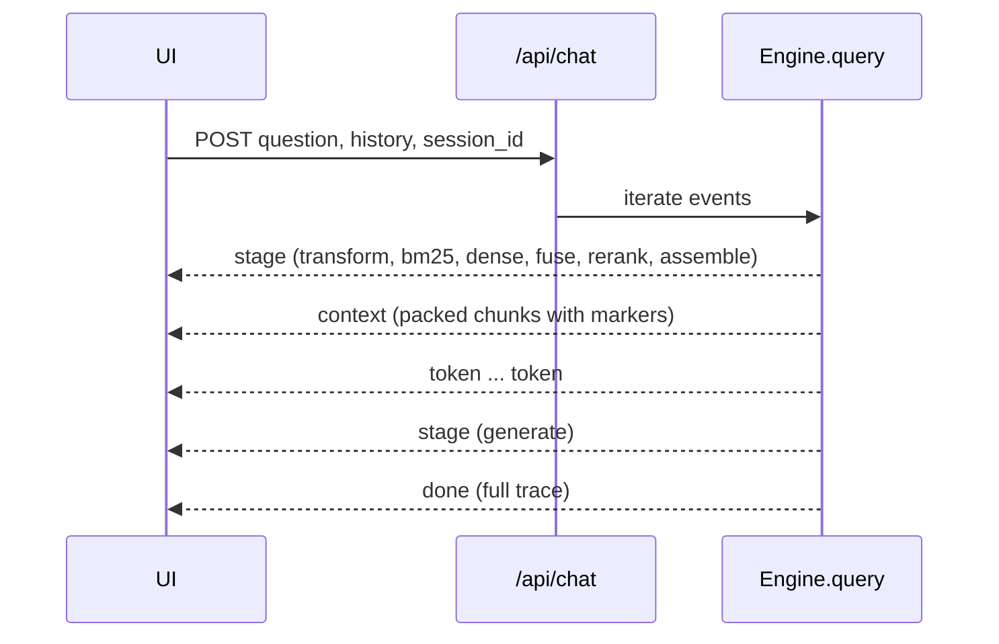

# API

The FastAPI app that serves the JSON and Server-Sent Events API under `/api` and, in serve mode, the built UI.

## Why
The UI exists to show retrieval while it happens, so the chat endpoint has to stream each stage as it finishes rather than return one JSON body at the end.
Everything else (documents, sessions, traces, config) is ordinary request and response, kept thin so the engine stays the only place that knows how the pipeline works.

## How it works
A process-wide `State` in `src/clearrag/api/app.py` holds the `Settings`, the current `PipelineConfig` and a lazily built `Engine`.
Handlers get the engine through the `engine()` dependency, which turns a `ProviderError` into a 503 carrying `message` and `remedy`.
The engine is rebuilt on the next request whenever it is dropped, which is how model switches take effect.
On startup the lifespan hook warms the chat and embedding models in a background task when `CLEARRAG_PRELOAD` is on; failures there are swallowed because a cold model still answers.
CORS allows only the Vite dev origin on port 5173, since the packaged app serves the bundle from the same process.

### Endpoint groups
- **Health and config:** `GET /api/health` returns per-component checks with remedies and never raises.
  `GET /api/config` returns the live config, the model defaults, the `config_hash` and the active providers.
  `PUT /api/config` patches the config and reports `reindex_needed` when an ingestion knob (parser, chunker, chunk size, overlap, context mode) changed.
- **Models and providers:** `GET /api/models` lists installed Ollama models split into chat and embedding by their `/api/show` capabilities, falling back to the tag name.
  `PUT /api/providers` switches `chat_model` or `embed_model` at runtime by dropping the engine, and flags `reindex_needed` on an embedder change.
- **Documents:** `GET/POST/DELETE /api/documents` list, upload (multipart, one ingest per file) and clear the corpus.
  `GET /api/documents/{id}` returns the full text, typed blocks and chunk spans the Library draws.
  `POST /api/documents/sample` is a one-shot import of the default sample set.
- **Sample sets:** `GET /api/samples` lists the bundled sets (`evals/corpus`, `evals/sec/corpus`) with how many files are already indexed.
  `POST /api/samples/{id}` streams per-file SSE progress (`start`, `file`, `warning`, `error`, `done`) and skips files already indexed by name.
  `DELETE /api/samples/{id}` removes a set's documents by filename.
- **Re-index:** `POST /api/reindex` rebuilds chunks, vectors and the keyword index under the current config; `POST /api/reindex/stream` is the same rebuild as per-document SSE.
- **Sessions:** `GET/POST /api/sessions`, `GET/PATCH/DELETE /api/sessions/{id}`.
  A session stores its document scope as `doc_ids` (null means the whole corpus), and `PATCH` with `all_documents: true` widens it back.
  `GET` returns each assistant message with its full trace attached, so a reopened chat keeps its stages and citations.
- **Chat:** `POST /api/chat` with `question`, `history` and an optional `session_id`, answered as SSE.
- **Embedding map:** `GET /api/map?query=` projects every chunk vector to 2D with PCA and optionally places the query and its five nearest neighbours; it needs at least three chunks.
- **Runtime:** `GET /api/runtime` reports which Ollama models are resident and how much of each sits in VRAM.
- **Traces:** `GET /api/traces` (optionally by `session_id`) and `GET /api/traces/{id}`.

### The chat stream
`Engine.query` in `src/clearrag/pipeline.py` is an async generator of events, and `/api/chat` forwards each one as a `data: <json>` line.

- `stage` carries one `StageRecord` as built by `stage_event` in `src/clearrag/query/context.py`.
- `context` carries the packed passages with their citation markers, from `context_event` in `src/clearrag/query/assemble.py`.
- `token` carries answer text as the model writes it.
- `done` carries the full trace; the API stores the assistant message and trace id on the session at this point.
- `error` carries `message` and `remedy`, for example an empty index, an out-of-scope session or an embedding-space mismatch.

The first question in an untitled session becomes its title.

### Static bundle
When `web/dist` exists, `/assets` is mounted as static files and a catch-all route returns `index.html` for every other non-API path, so client-side routing owns deep links.
`_find_web_dist` checks `CLEARRAG_WEB_DIST`, then the source checkout, `/app/web/dist` and the working directory, so one code path works from a checkout, a container and a site-packages install.

## Tech
FastAPI, uvicorn, pydantic, `StreamingResponse` with `text/event-stream`, httpx for Ollama calls.

## Key files
- `src/clearrag/api/app.py` - every route, the process state, sample sets and the SPA fallback
- `src/clearrag/pipeline.py` - `Engine.query`, `ingest`, `reindex_events`, `healthcheck`
- `src/clearrag/query/context.py` - `stage_event`, the shape of a streamed stage
- `src/clearrag/index/project.py` - the PCA projection behind `/api/map`
- `src/clearrag/providers/runtime.py` - the `/api/ps` readout behind `/api/runtime`
- `web/src/lib/api.ts` - the client, including the hand-rolled SSE parser

## Decisions and gotchas
- SSE rather than WebSockets: traffic is one-directional and survives proxies.
- The client parses SSE by hand because `EventSource` only issues GET, and chat and imports are POSTs.
- Streaming responses send `X-Accel-Buffering: no` so a reverse proxy does not hold events back.
- `PUT /api/config` accepts ingestion knobs but only documents indexed afterwards use them; the response says so instead of implying the corpus changed.
- Session scope is document ids, not chunk ids, because chunk ids change on every re-index.
- Sample imports skip by filename before parsing, because the content-hash short-circuit only fires after the expensive PDF parse.
- `/api/models` and `/api/runtime` are best effort and return empty results instead of errors when Ollama is down.

## Related
- [Query pipeline](query-pipeline.md)
- [Tracing](tracing.md)
- [Providers](providers.md)
- [Configuration](configuration.md)
- [Web UI](web-ui.md)
