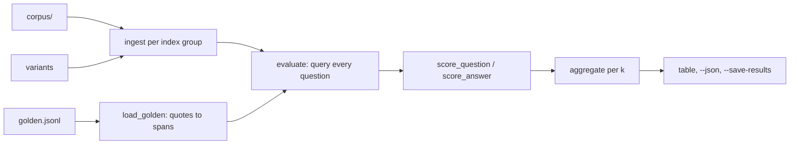

# Evaluation

The benchmark harness: golden sets labelled with source spans, deterministic metrics, and the ablation sweep that produces every results table.

## Why

The project exists to measure what each retrieval technique is worth, not to collect techniques.
Without a stable benchmark, a change to chunking, fusion or parsing cannot be called an improvement or a regression.
Retrieval metrics alone also miss real failures, so a second family of metrics grades the generated answers.

## How it works

**Suites.**
Each suite is a corpus directory plus a `golden.jsonl`, chosen with `--suite`.
- `retrieval` (default): `evals/corpus/` and `evals/golden.jsonl`, ten Markdown documents about a fictional engineering org, tagged `lexical`, `semantic`, `distractor` and `paraphrase`.
- `sec`: `evals/sec/`, curated 10-K sections rendered as PDFs, tagged `table`, `structure` and `cross-company`; see `evals/sec/README.md`.
- `attribution`: `evals/attribution/`, one staff profile whose sections share vocabulary, so retrieval is trivially perfect and every failure is a generation failure.

**Golden set format.**
One JSON object per line, `//` lines are comments.
Fields: `id`, `question`, `relevant` (a list of `{doc, quote}`), optional `must_mention`, `must_not_mention`, `unanswerable` and `tags`.
`load_golden` resolves each quote to a character span in the document text by matching its content tokens in order, tolerating any separators between them.
A quote that matches nothing or matches twice is a hard error, as are duplicate ids, unknown documents, and unanswerable questions that carry spans.

**Retrieval metrics** (`eval/metrics.py`) are pure arithmetic over the final ranking.
A chunk covers a label when it contains at least half of the labelled span.
recall@k is the fraction of labelled spans covered in the top k, not the fraction of relevant chunks, so the denominator does not move when chunk size changes.
MRR, nDCG (binary gains) and hit rate are reported beside it, at k of 1, 3, 5 and 10.
Tag columns are recall restricted to questions with that tag; `TAG_COLUMNS` in `eval/results.py` picks which tags each suite's table shows.
The ranking scored is the last retrieval stage in the trace; assembly is excluded because its drops are packing concerns, not retrieval quality.

**Generation metrics** run only with `--generate`, with no judge model:
- refusal accuracy on unanswerable questions, and false refusals on answerable ones (`generate/prompt.py:is_refusal`).
- required mentions: every `must_mention` string appears in the answer.
- wrong-section bleed: any `must_not_mention` string appears.
- grounding: at least one citation covers a labelled span; citation precision is the share of citations that do.

**Runner and variants.**
`eval/runner.py:ablate` groups variants by ingest signature and embedding model, ingests each group once into its own workspace, then queries every question.
Golden quotes resolve leniently against each group's parsed text, so a parser that lost an answer scores a miss instead of crashing the sweep.
`eval/variants.py` defines the sweeps: `standard_variants` walks from the 2024 dense-only baseline to the reranked pipeline plus chunk sizes, `sec_variants` varies parser, chunker and context mode one at a time, and `attribution_variants` varies chunk size.
The embedding model rides on `Variant.embed_model`, not on `PipelineConfig`, because it is an index identity; extra embedders get a dense-only and a hybrid + RRF row each.

**Parse quality** (`eval/parse_quality.py`) differentially tests PDF parsers against tag-stripped text from the same filings' HTML.
It reports word recovery (order-insensitive multiset overlap) and order similarity (`SequenceMatcher` over word sequences).

**Commands.**
- `clear-rag eval [--suite S] [--generate] [--fake] [--k N] [--json PATH] [--set KEY=VALUE]` scores the current config; `--chunk-size`, `--chunk-overlap`, `--corpus`, `--golden` and `--workspace` override inputs.
- `clear-rag ablate` takes the same flags plus `--markdown PATH`, `--embedder MODEL` (repeatable) and `--save-results [PATH]`.
- `clear-rag parse-quality [--parser NAME] [--corpus DIR] [--ground-truth DIR] [--save-results [PATH]]`.
- `python scripts/fetch_sec.py` re-downloads the filings; EDGAR needs a declared User-Agent, and PDFs render via headless Chromium.

## Tech

The real `Engine` with Ollama models for measured runs, or fake providers (`--fake`) for deterministic ones.
`difflib.SequenceMatcher` scores reading order.

## Key files

- `src/clearrag/eval/golden.py` - golden set loading and quote-to-span resolution
- `src/clearrag/eval/metrics.py` - coverage, per-question scores, aggregates
- `src/clearrag/eval/runner.py` - `evaluate`, `ablate`, provenance, Markdown table
- `src/clearrag/eval/variants.py` - the sweeps and the `EMBEDDERS` candidates
- `src/clearrag/eval/parse_quality.py` - parser differential scoring
- `src/clearrag/__main__.py` - `eval`, `ablate`, `parse-quality` commands
- `scripts/fetch_sec.py` - rebuilds the SEC corpus and ground truth from EDGAR

## Decisions and gotchas

- Labels anchor to spans, never chunk ids, because chunk ids change with every chunking setting and comparing chunkings is the point.
- `eval` forces `k_final` to at least 10 so every cutoff has enough chunks to score.
- Without `--embedder`, `ablate` measures `all-minilm` and `mxbai-embed-large` only when Ollama has them pulled, and prints the pull command otherwise.
- Workspaces are keyed by embedder id, because a reused workspace under another model would be refused as a space mismatch and score a row of zeros.
- Answerable and unanswerable questions are aggregated separately; averaging them hides both.
- Generated answers vary by a question or two between runs even at low temperature.
- The attribution suite exists because of a real failure: a one-page résumé indexed into three chunks, every query retrieved all of them, and a small model still refused or cited the wrong section; recall@k rated it flawless.
- A correct "I don't know" scores as correct behaviour, because the predecessor scored answers by similarity to their context and penalised honest refusals.

## Related

- [Results files](results-files.md)
- [Testing](testing.md)
- [Parsers](parsers.md)
- [Query pipeline](query-pipeline.md)
- [Large corpus benchmark spec](specs/large-corpus-benchmark.md)
- [Query decomposition spec](specs/query-decomposition.md)
