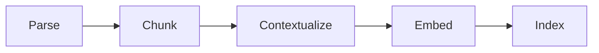

# Ingestion

How an uploaded file becomes indexed chunks: Parse, Chunk, Contextualize, Embed, Index.

## Why
Retrieval can only find what ingestion produced, and most RAG failures start here: a chunk cut through the middle of a section, or text that cannot be traced back to its source.
Every choice in this flow is a `PipelineConfig` knob, so chunking and context strategies can be compared in the ablation table instead of argued about.
Without exact source spans, citations could only name a chunk number, and the golden set could not score chunking strategies against each other.

## How it works

`Engine.ingest` in `src/clearrag/pipeline.py` runs the stages in order, recording each one as a stage in a `Trace` (see [tracing](tracing.md)).

**Parse.** `ingest/parse.py` turns `.pdf`, `.docx`, `.md`, `.markdown`, `.txt` and `.csv` into a `Document` whose `text` is the single source of truth.
PDFs go through the configured parser backend (see [parsers](parsers.md)); Markdown gets heading and paragraph blocks from ATX headings; DOCX gets heading styles and pipe-flattened tables; other text is one paragraph block.
A file that yields no text raises `EmptyExtraction` with an OCR hint.

**Content hash short-circuit.** The document hash is SHA-256 of the raw bytes.
If a document with that hash is already stored, ingest returns `status: unchanged` before chunking or embedding anything.
The document id is derived from filename and hash, so re-ingesting the same file yields the same id.

**Chunk.** The `chunker` knob picks one of two strategies.
- `recursive` (`ingest/chunk.py`) splits on the largest separator that fits (`\n\n`, `\n`, `. `, space), hard-splits on token boundaries as a last resort, then packs pieces into windows of `chunk_size` tokens with `chunk_overlap` tokens of backup.
  The overlap start snaps forward to a word boundary so no chunk opens on a word fragment.
- `semantic` (`ingest/structural.py`) cuts on parsed heading boundaries and greedily packs whole sections up to the budget, with no overlap.
  A section larger than one chunk is split where embedding distance between adjacent paragraphs (or sentences) spikes above mean plus one standard deviation, then recursively if still too large.
  A document with no blocks falls back to recursive chunking, recorded as `fallback: recursive` in diagnostics.

Token counts use tiktoken `cl100k_base` as a model-agnostic stand-in.
Chunk diagnostics carry the token histogram and every boundary span, which the Library's chunk inspector draws over the document.

**Contextualize.** `ingest/contextualize.py` fills `Chunk.context` according to `context_mode`.
- `none`: no preamble.
- `breadcrumb`: the document label plus the heading path above the chunk, derived from parse blocks; deterministic and free.
- `llm`: a chat model writes one or two situating sentences per chunk, capped at 300 characters, cached in the store's `context_cache` table.
Context changes only `Chunk.indexed_text` (context, blank line, text), which is what gets embedded and BM25-indexed; stored text, spans and citations never see it.

**Embed and Index.** Chunks are embedded with `kind="document"`, added to the vector and lexical indexes, written to SQLite, and both indexes are persisted (see [indexes](indexes.md)).
The document's `meta` is stamped with the chunker, sizes, context mode and embedder it was built with, so the UI shows what a document actually carries rather than what the config currently says.

**Re-index.** `Engine.reindex_events` rebuilds every stored document from its stored text under the current config, streaming per-document progress.
New indexes are built off to the side and swapped in only after every document succeeds, so a mid-rebuild failure leaves the previous indexes intact.
Re-index skips the embedding-space guard on purpose, because rebuilding every vector is the fix that guard asks for.

## Tech
tiktoken, numpy, python-docx; parser libraries per [parsers](parsers.md).

## Key files
- `src/clearrag/pipeline.py` - `Engine.ingest`, `reindex_events`, `delete_document`
- `src/clearrag/ingest/parse.py` - format dispatch, Markdown and DOCX blocks, document ids
- `src/clearrag/ingest/chunk.py` - recursive chunker, deterministic chunk ids, overlap snapping
- `src/clearrag/ingest/structural.py` - semantic (structure-first) chunker
- `src/clearrag/ingest/contextualize.py` - breadcrumb and LLM context, cache keys
- `src/clearrag/core/types.py` - `Document`, `Block`, `Chunk`

## Decisions and gotchas
- **Spans are the invariant.** Every chunk is a contiguous `(start, end)` span of `Document.text`; citations, highlighting and span-anchored evaluation all depend on it, so no chunker may return bare strings.
- **Chunk ids are deterministic**, a hash of document id, ordinal and span.
  BM25 and RRF break score ties on chunk id, so random ids made two runs over the same corpus score differently.
- **Default overlap is 64 of 512 tokens**, not the predecessor's 50%, which doubled the index and filled top-k with near-duplicates.
- **Re-index cannot re-parse.** The original bytes are not kept, so a PDF parsed by a different backend keeps its old text; re-index reports a `note` counting those files and asks for a re-upload.
- **LLM context cache key** is document hash, span, model and `CONTEXT_PROMPT_VERSION`.
  Bump the version when the prompt changes, or old and new generations mix silently.
- **LLM context degrades per chunk.** A provider error on one chunk falls back to its breadcrumb instead of failing the ingest.
- An unchanged upload returns before any chunking, so changing a chunk knob and re-uploading does nothing; use re-index.

## Related
- [Parsers](parsers.md)
- [Indexes](indexes.md)
- [Tracing](tracing.md)
- [Configuration](configuration.md)
- [Atomic table chunks spec](specs/atomic-table-chunks.md)
