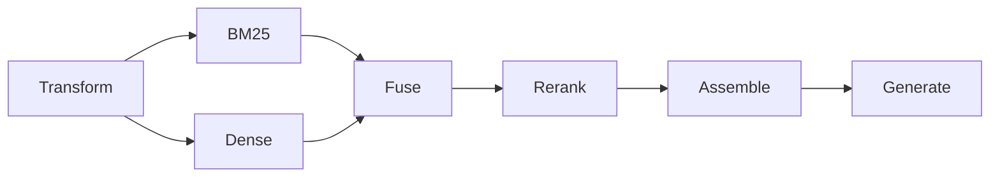

# Query pipeline

The query path turns a question into ranked chunks, packed context and a cited answer, emitting one stage event per step.

## Why
The whole point of clear-rag is that retrieval is visible while it happens, so every step must be a discrete, inspectable stage rather than one opaque call.
Each stage lives in its own module, so adding a technique is a new module plus one line in the engine, and the trace and event machinery need no change.
Without a shared candidate type the UI would need per-stage code to show how a chunk moved between steps.

## How it works

`Engine.query` in `src/clearrag/pipeline.py` is an async generator that only composes stages and yields an event after each one.
It builds a `QueryContext` (config, open trace, providers, store, indexes, optional document filter) and passes it to every stage, so a stage never reaches back into the engine.
Each stage has the shape `(context, inputs) -> (outputs, StageRecord)`.

**The Candidate contract.**
BM25, dense search, fusion and rerank all consume and produce `list[Candidate]` (`src/clearrag/core/types.py`).
`rank` is 1-based and relative to the stage that emitted it, so movement between stages is `rank_before - rank_after`.
Stage-specific extras (matched terms, per-retriever contributions, per-phrasing ranks) ride in `Candidate.detail`.

**Transform.**
With `rewrite_followups` on and history present, the chat model rewrites a follow-up into one standalone search query.
The rewrite prompt (`REWRITE_SYSTEM` in `src/clearrag/generate/prompt.py`) explicitly forbids answering, which inverts the predecessor's bug of searching with a hallucinated answer.
The resolved query is stored on `Trace.resolved_query` and is what rerank and generation see.
With `query_transform="multi"`, the chat model also writes `query_variants` alternative phrasings; the original always searches too.
A provider failure in either step degrades to the query already in hand.

**Retrieve.**
Keyword and vector search run concurrently under one `asyncio.gather`, each timing itself.
`retrieval` selects `dense`, `lexical` or `hybrid`, and each retriever returns up to `k_candidates`.
With several phrasings, each retriever first fuses its own per-phrasing rankings by reciprocal rank (`merge_variants`), so the UI still gets exactly one keyword and one vector ranking.
A provider failure here ends the query with an error event, since there is nothing to fall back to.

**Fuse.**
`fusion="rrf"` sums `1 / (rrf_k + rank)` per retriever, so scores on incomparable scales never mix.
`fusion="weighted"` min-max normalises each retriever's scores and weights them by `dense_weight`; it exists mainly as an ablation comparison.
Every fused candidate records per-retriever contributions and `found_by`, which drives the rank-flow diagram.
With a single retriever no fuse stage is recorded at all.

**Rerank.**
When `rerank` is on, the cross-encoder re-scores the whole fused list and keeps `k_final`; otherwise the fused order is truncated to `k_final`.
It runs under `degradable`, so a model load or scoring failure falls back to fusion order and is marked degraded.
With no reranker installed the stage is still recorded, as degraded and unavailable.

**Assemble.**
Chunks are packed into `max_context_tokens`, skipping any chunk whose span overlaps an accepted one by more than half, and recording every drop with its reason.
Kept chunks get stable `[n]` markers; the chunk id is deliberately left out of the prompt because small models parroted it.
A `context` event then sends the packed passages, with spans and ordinals, to the UI.
`generate=False` stops here, which is how retrieval-only evaluation avoids one LLM call per question.

**Generate.**
`Generation` streams tokens as `token` events, then `finish()` resolves `[n]` markers back to chunks as `Citation`s with exact spans.
Markers that point at passages never supplied are dropped and listed as `hallucinated_markers`.
Diagnostics split the wait into time to first token (prefill) and decode rate, and flag the instructed refusal.

## Tech
- `asyncio` for concurrent retrieval, tiktoken (`count_tokens`) for the context budget.
- Chat and embedding providers behind the protocols in [providers](providers.md).

## Key files
- `src/clearrag/pipeline.py` - `Engine.query`, composes the stages and yields events.
- `src/clearrag/query/context.py` - `QueryContext` and `stage_event`.
- `src/clearrag/query/transform.py` - follow-up rewrite and multi-query expansion.
- `src/clearrag/query/retrieve.py` - concurrent BM25 and dense search, per-phrasing merge.
- `src/clearrag/query/fuse.py` - reciprocal rank fusion and weighted fusion.
- `src/clearrag/query/rerank.py` - optional cross-encoder stage.
- `src/clearrag/query/assemble.py` - dedup, token budget, markers, `context` event.
- `src/clearrag/query/generate.py` - streaming answer, citations, speed diagnostics.
- `src/clearrag/generate/prompt.py` - rewrite, expansion and answer prompts, citation parsing.

## Decisions and gotchas
- RRF ties break on chunk id, which is why chunk ids must be deterministic (see [ingestion](ingestion.md)).
- `doc_ids` scopes a query to documents, resolved to chunk ids at query time, because chunk ids change on every re-index.
- The query refuses to run when the stored index was built by another embedder (see [indexes](indexes.md)).
- `query_transform="hyde"` and `self_correct` exist in the config but are not built; see [HyDE](specs/hyde.md) and [self-correction](specs/self-correction.md).
- Multi-query and rerank effects are measured, not assumed; read the numbers in `README.md` or `evals/results/retrieval.json`.

## Related
- [Tracing](tracing.md)
- [Indexes](indexes.md)
- [Providers](providers.md)
- [Configuration](configuration.md)
- [Evaluation](evaluation.md)
- [Query decomposition spec](specs/query-decomposition.md)
