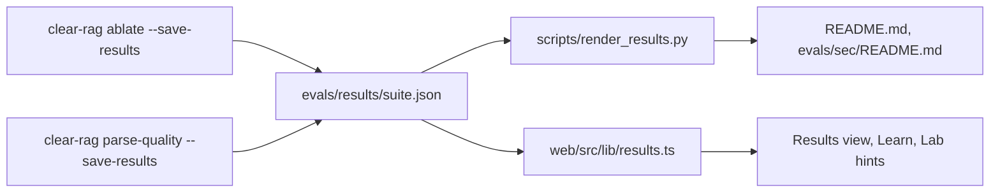

# Results files

Committed benchmark output, one JSON file per suite, from which the README tables and the interface's numbers are all rendered.

## Why

The ablation table used to be hand-copied into the README, the Learn page's prose and charts, and the Lab's knob hints.
Those copies drifted the first time the golden set grew, and twelve numbers went stale in one day.
Making the tool's own output the single source means a re-measurement changes a number everywhere or nowhere.

## How it works

**Files.**
`evals/results/` holds `retrieval.json`, `sec.json`, `attribution.json` and `parse-quality.json`.
A suite file has `suite`, `k`, `corpus` (document, question and answerable counts) and `rows`.
Each row is an `EvalRun.to_dict()`: label, config and its hash, `generated`, per-k aggregates, per-question results, timings and `provenance`.

**Merge semantics** (`eval/results.py:merge_results`).
Writing never overwrites the file; it merges.
A row's identity is its label, plus the chat model when the row's answers were generated, since answers depend on the model and retrieval does not.
Rows the sweep produced replace rows with the same identity; rows it did not produce survive.
Rows follow the sweep's variant order, and unknown rows (imported ones, or a backend not installed here) trail in their previous order.
Parse-quality rows are keyed by file and backend, and per-backend means are recomputed over all rows.

**Provenance.**
Every row records `measured_at`, `chat_model`, `embed_model`, `reranker` and `source`.
A row copied from an earlier run is marked `source: "imported"` with a `note`, and the rendered table footnotes it with a dagger.

**Rendering.**
`scripts/render_results.py` renders each suite's table between `<!-- results:<suite> -->` and `<!-- /results:<suite> -->` markers.
`RENDERED_IN` lists which documents show which suite: README.md shows retrieval, attribution and sec; `evals/sec/README.md` shows sec and parse-quality.

**Drift check.**
`render_results.py --check` exits non-zero if any marked table would change.
It also scans `PROSE_DOCUMENTS` (both READMEs, `web/src/lib/topics.ts`, `web/src/lib/knobs.ts`) for three-decimal numbers that appear in no results file.
Generated regions are skipped, and a table measured elsewhere can be excluded by wrapping it in `<!-- prose-check:off -->` and `<!-- prose-check:on -->`.
CI runs the check, and `tests/eval/test_results.py` asserts the same two properties so `pytest` catches drift locally.

**The web import.**
`web/src/lib/results.ts` imports the four JSON files at build time and types them.
The Results view, `lib/benchmarks.ts` (Learn charts), `lib/topics.ts` and `lib/knobs.ts` read numbers through its accessors.
Vite's dev server is allowed to read outside `web/` (`server.fs.allow` in `web/vite.config.ts`) for exactly this import.

**After a re-measurement.**
1. Run `clear-rag ablate --suite <suite> --save-results` (add `--generate` for attribution).
2. Run `python scripts/render_results.py` to update the README tables.
3. Fix any prose drift it reports by updating the hand-written number.
4. Run `pytest` and commit the JSON and README together.

## Tech

JSON on disk, Python for merging and rendering, Vite JSON imports in the web app.

## Key files

- `src/clearrag/eval/results.py` - merge, provenance identity, table rendering, drift detection
- `scripts/render_results.py` - renders or checks every marked region and prose document
- `evals/results/*.json` - the committed results
- `web/src/lib/results.ts` - typed import and accessors for the interface
- `tests/eval/test_results.py` - merge rules and the committed-files checks

## Decisions and gotchas

- Never hand-edit a table between results markers; the next render overwrites it and CI fails until then.
- Docs under `docs/` are not in `PROSE_DOCUMENTS`, so they should link to results rather than quote numbers.
- Imported rows stay until something re-measures them, which is how the docling row survives in an environment without docling.
- The drift check only knows three-decimal values; other number formats in prose are not verified.
- The bundled JSON includes per-question results, so it adds noticeably to the web bundle size.

## Related

- [Evaluation](evaluation.md)
- [Web UI](web-ui.md)
- [Testing](testing.md)
